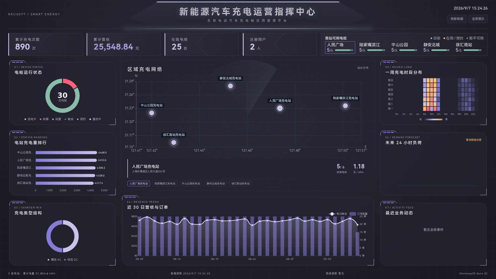

# 东软电动汽车充电桩应用管理平台

北京理工大学「软件工程综合实践」课程项目，实现找桩、预约、充电、结算、设备管理、运营大屏和负荷预测。手机号登录、充值和充电设备采用模拟方式。



管理端表格支持搜索、列筛选、排序、复制和 CSV 导出。点击表头排序，点击列头图标筛选；`Ctrl+F` 搜索，`Ctrl+C` 复制选区。

移动端订单按页加载，滚动到底部继续加载，下拉刷新。金额与充电指标使用滑动动画，居中提示允许点击穿透。

界面使用 [HarmonyOS Sans SC](https://developer.huawei.com/consumer/cn/design/resource/)，字体与[授权协议](shared/fonts/LICENSE.txt)随软件内置。
管理端侧栏与用户端“我的”提供外观设置，可调整主色、副色，选择浅色、深色或跟随系统。

## 运行

环境：Ubuntu 22.04+、C++17、Qt 6.2+、CMake、Node.js、pnpm、Python 3.10+、uv。

```bash
bash scripts/setup_env.sh
bash scripts/build.sh

# 用户端与管理端默认连接共用联调服务器
bash scripts/run.sh user
bash scripts/run.sh admin

# 如需独立本地服务，在各终端显式指定本地地址
bash scripts/run.sh server
CHARGING_SERVER_URL=http://127.0.0.1:8080 bash scripts/run.sh user
CHARGING_SERVER_URL=http://127.0.0.1:8080 bash scripts/run.sh admin
```

共用服务与大屏：https://www.u910784.nyat.app:40004。管理端登录页可直接修改服务器地址；Web 开发代理默认连接同一服务。已有 CMake 构建目录需要重新配置 `-DCHARGING_DEFAULT_SERVER_URL=https://www.u910784.nyat.app:40004`。本地服务大屏为 http://127.0.0.1:8080。管理员：`admin / 123456`。用户输入以 1 开头的 11 位手机号自动注册，演示账号：`13800000001`、`13800000002`。

首次启动生成五站三十桩及近 35 天模拟订单。新用户需先充值；充电默认以 60 倍速运行，预测自动生成，也可在管理端手动触发。

```bash
bash scripts/test.sh
# 空业务环境
bash scripts/run.sh server --data-dir /tmp/charging-empty --no-seed
# 自定义端口与充电倍率
bash scripts/run.sh server --time-scale 600 --port 8081
CHARGING_SERVER_URL=http://127.0.0.1:8081 bash scripts/run.sh user
```

Android 使用系统定位和地图选点，导航打开高德 App 或官方网页版；桌面端的腾讯地图地址解析配置见[初始化指南](docs/00_初始化指南.md)。移动端构建、共用服务和实测记录见 [Mac 联调环境](docs/Mac联调环境.md)。

## 目录与文档

| 目录 | 内容 |
| --- | --- |
| apps/user-app | Qt Quick 用户端与内嵌地图 |
| apps/admin-app | Qt Widgets 管理端 |
| apps/server、shared | C++ 服务、API 客户端与共用外观 |
| database | SQLite 结构；运行数据位于 data/platform.db |
| web | Vue 3 / ECharts 大屏 |
| ml | Python 预测、数据下载、回测和报告 |
| scripts、tests | 共用构建、启动、检查脚本与自动化测试 |
| docs、spec | 设计、运行与验收说明 |
| reference | 项目要求、参考材料与数据来源 |

- [需求对照](spec/TODO.md) · [项目要求书](reference/东软电动汽车充电桩应用管理平台项目要求书.md)
- [系统设计](docs/系统设计.md) · [数据库架构](docs/数据库架构设计.md) · [接口契约](docs/接口契约.md)
- [界面规范](docs/界面设计规范.md) · [测试与演示](docs/验收报告.md)
- [大屏开发](web/README.md) · [预测与回测](ml/README.md)

第三方许可随[大屏源码](web/third-party/README.md)和用户端图标保留。
