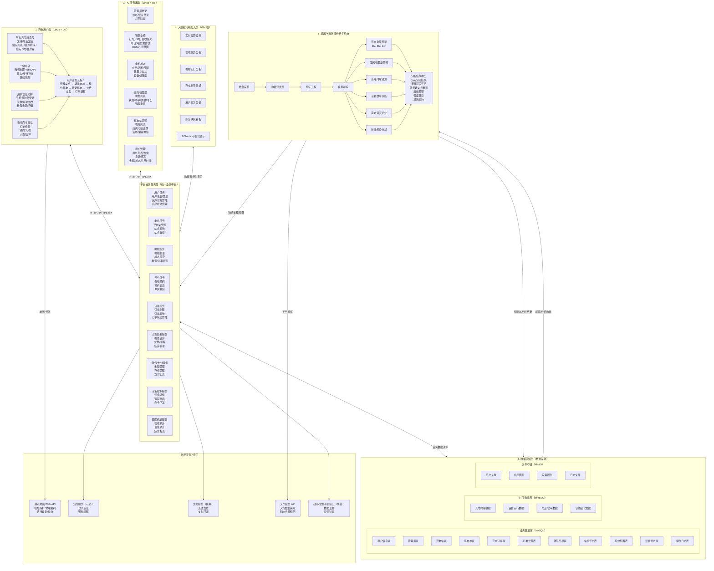
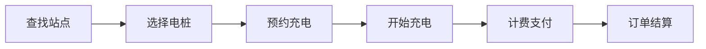
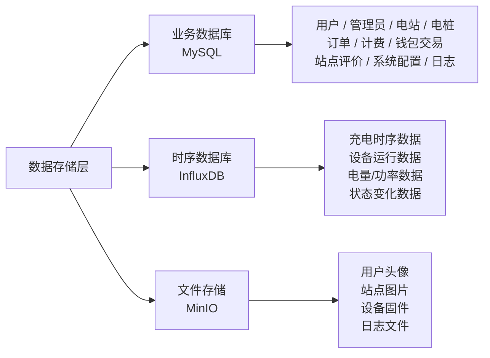
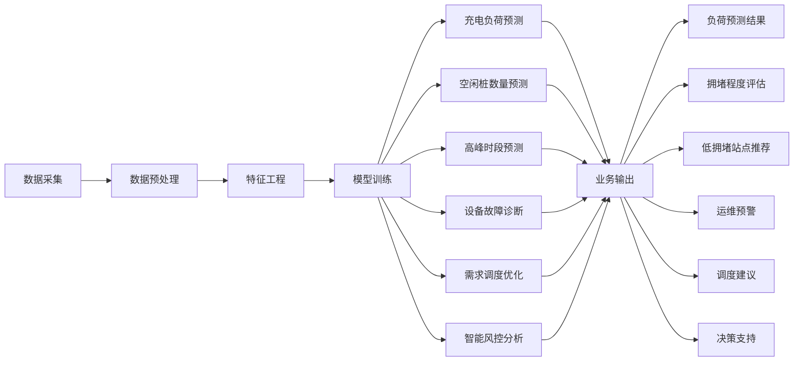
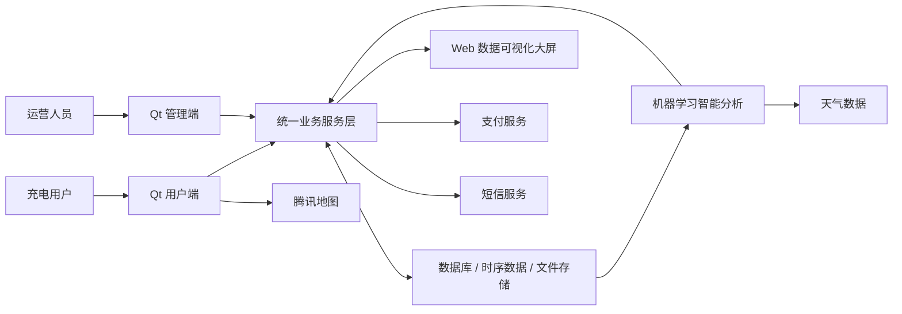

# 图片内容说明

## 管理员端参考界面

这些图片均属于 PC 服务器端 / 运营管理后台参考界面。总体上采用 Windows 桌面应用形式，主界面为宽屏布局，以深色数据看板、表格、统计图为主。

---

### `images/admin-interface-01.png`

#### 管理后台——数据总览

这是充电桩运营管理后台的首页/数据总览页。

整体采用深蓝黑色背景和青蓝色高亮的科技风格。窗口顶部标题为：

> 充电桩运营管理后台

#### 页面总体布局

```text
┌──────────────────────────────────────────────────────────────┐
│                    充电桩运营管理后台                         │
│                                    时间        管理员：admin │
├──────────────┬───────────────────────────────────────────────┤
│ 左侧导航栏   │ 数据总览                                      │
│              │                                               │
│ 数据总览     │ [今日营收] [本月营收] [累计营收] [今日订单]   │
│ 电站管理     │                                      [注册用户]│
│ 电桩管理     │                                               │
│ 订单管理     │ ┌───────────────────────┐ ┌───────────────┐ │
│ 用户管理     │ │      营收趋势折线图   │ │ 电桩状态环图  │ │
│              │ └───────────────────────┘ └───────────────┘ │
│              │                                               │
│              │ ┌───────────────────────┐ ┌───────────────┐ │
│              │ │ 各电站累计营收柱状图  │ │充电中订单     │ │
│              │ │                       │ │故障电桩       │ │
│ 退出登录     │ └───────────────────────┘ └───────────────┘ │
└──────────────┴───────────────────────────────────────────────┘
```

#### 左侧导航栏

顶部带闪电图标和“充电运营管理”字样，下面依次为：

1. 数据总览
2. 电站管理
3. 电桩管理
4. 订单管理
5. 用户管理

当前“数据总览”被高亮。

左下角提供“退出登录”。

#### 顶部状态信息

右上方显示：

* 当前时间，例如 `2026-08-28 14:07:59`
* 当前登录人员：`管理员：admin`

#### 第一行 KPI 指标卡

从左到右共 5 个卡片，示例数据：

| 指标   | 示例值         |
| ---- | ----------- |
| 今日营收 | `0.00 元`    |
| 本月营收 | `2011.08 元` |
| 累计营收 | `2225.61 元` |
| 今日订单 | `0 笔`       |
| 注册用户 | `6 人`       |

数字采用较大的亮青色字体突出显示。

#### 营收趋势

页面中部左侧是一张较大的折线图：

* 标题：营收趋势
* 可以选择类似“近7天”的时间范围。
* 横轴为日期，如 08-22 ～ 08-28。
* 纵轴为营收金额。
* 曲线展示每日营收变化。
* 图例为“营收（元）”。

#### 电桩状态分布

中部右侧为环形图：

* 标题：电桩状态分布
* 用不同颜色表示闲置、在用、故障等状态。
* 示例图中的主要占比约为 `88%` 与 `13%`。
* “在用”示例数量为 0。

该图用于一眼观察所有充电桩的整体运行健康状况。

#### 各电站累计营收排行

左下方是一张柱状图：

* 标题：各电站累计营收排行
* 横轴为不同充电站。
* 纵轴为累计营收。
* 示例电站包括：

  * 福田CBD……
  * 南山科技……
  * 深圳市民……
  * 深圳湾公……
  * 宝安中心……
  * 龙岗大运……

用于比较各站点经营情况。

#### 右下状态列表

右下区域分为两个信息区：

充电中订单

* 展示当前正在充电的订单。
* 图片中显示“暂无充电中订单”。

故障电桩

* 列出当前故障设备。
* 示例：

  * `SZ001-03 · 深圳市民中心充电站`
  * `SZ002-04 · 深圳湾公园充电站`

---

### `images/admin-interface-02.png`

#### 第三方物联网监控大屏风格参考

这张图片并非完全按照本项目业务制作，而是一张 EMCP 物联网云平台监控大屏截图，主要作为服务器端数据监控页面的视觉参考。

整体采用高饱和深蓝色科技风格，背景带电子电路纹理。

#### 页面布局

顶部是一条导航栏，包含：

* EMCP 物联网云平台 Logo
* 设备监控
* 数据中心
* 设备地图
* 后台管理
* 帮助
* 消息
* 当前用户

主内容区域由大量矩形监控组件组成。

#### 第一排数字指标

顶部有 4 个大型数字卡片，例如：

* `10.99`
* `45.18`
* `1.03`
* `0.82`

每个数字下面都有对应的工业监测指标名称。

#### 中部图表

包含：

* 饼图：展示三类数据占比。
* 圆形液位计。
* 柱状液位计。
* 环形百分比仪表。
* 柱状图：比较多种实时数据。

#### 下方仪表

存在多个汽车仪表盘式组件，例如：

* 圆形指针仪表。
* 半圆刻度盘。
* 大数字 + 刻度组合。

示例数值包括 `107.54`、`106.53`、`83.81`。

#### 右侧

右上为实时数据柱状图，右下为随时间变化的折线图。

这张参考图主要说明：运营管理端可以采用工业监控/数据大屏式组件，将关键运行指标通过数字卡、仪表盘、折线图、柱状图和饼图集中展示。

---

### `images/admin-interface-03.png`

#### 管理后台——电站管理

与数据总览页面使用相同的深色后台框架。

左侧导航栏仍为：

* 数据总览
* 电站管理
* 电桩管理
* 订单管理
* 用户管理

当前选中 电站管理。

#### 页面布局

顶部左侧有搜索框：

> 搜索站名/地址...

右上角有一个醒目的按钮：

> `+ 新增电站`

下方主体是一张占据大部分窗口的电站数据表。

#### 表格字段

从左至右为：

| 字段      | 含义         |
| ------- | ---------- |
| ID      | 电站 ID      |
| 电站名称    | 充电站名称      |
| 地址      | 详细地址       |
| 电价（元/度） | 当前充电单价     |
| 总桩数     | 电站拥有的充电桩数量 |
| 空闲桩     | 当前可用充电桩数量  |
| 在线率     | 电桩当前在线比例   |
| 创建时间    | 电站记录创建时间   |

示例站点包括：

* 深圳市民中心充电站
* 深圳湾公园充电站
* 南山科技园充电站
* 福田CBD充电站
* 宝安中心充电站
* 龙岗大运中心充电站

示例在线率有：

* 83.3%
* 75.0%
* 87.5%
* 100.0%

#### 设计意图

该页属于典型“搜索 + 新增 + 数据表格”的后台 CRUD 页面。

实际实现时，点击某个电站还应能够进一步查看该站所属充电桩的状态和详细信息。

---

### `images/admin-interface-04.png`

#### 管理后台——电桩管理

当前左侧导航高亮 电桩管理。

#### 顶部筛选区

存在三个主要筛选控件：

1. 搜索框：`搜索电桩编号...`
2. 电站筛选下拉框：`全部电站`
3. 状态筛选下拉框：`全部状态`

#### 主体表格

表格字段为：

| 字段       | 含义            |
| -------- | ------------- |
| 电桩编号     | 如 SZ001-01    |
| 所属电站     | 该桩所在电站        |
| 类型       | 快充 / 慢充       |
| 功率（kW）   | 如 120.0 或 7.0 |
| 状态       | 闲置 / 故障等      |
| 累计充电次数   | 历史完成次数        |
| 累计时长（分钟） | 历史总工作时间       |
| 操作       | 对设备执行管理操作     |

#### 状态表示

* 闲置使用青绿色文字。
* 故障使用醒目的红色文字。

例如：

```text
SZ001-01  深圳市民中心充电站  快充  120.0kW  闲置
SZ001-03  深圳市民中心充电站  快充  120.0kW  故障
SZ002-04  深圳湾公园充电站    慢充    7.0kW  故障
```

#### 故障设备操作

故障电桩对应的“操作”列中出现红色边框按钮：

> 远程重启

正常电桩则没有该按钮或无需执行相关操作。

列表较长，右侧具有垂直滚动条。

---

### `images/admin-interface-05.png`

#### 管理后台——订单管理

当前左侧导航高亮 订单管理。

#### 顶部查询条件

顶部是一整行筛选器：

* 搜索框：`搜索订单号...`
* 状态下拉框：`全部状态`
* 日期范围：

  * 从 `2026-07-29`
  * 至 `2026-08-28`

#### 订单表格

表格信息非常密集，字段包括：

| 字段    | 含义         |
| ----- | ---------- |
| 订单号   | 充电订单唯一编号   |
| 用户手机号 | 下单用户       |
| 电站    | 使用的充电站     |
| 电桩    | 使用的充电桩编号   |
| 状态    | 待结算 / 已结算等 |
| 预约时间  | 用户预约时间     |
| 开始时间  | 实际开始充电时间   |
| 结束时间  | 实际结束时间     |
| 电量（度） | 本次充入电量     |
| 金额（元） | 本次订单费用     |
| 操作    | 管理操作       |

#### 状态显示

大部分历史订单显示绿色：

> 已结算

第一行示例订单显示蓝色：

> 待结算

该行右侧出现按钮：

> 代结算

表示后台管理员可以辅助处理尚未完成结算的订单。

页面同时存在纵向和横向滚动条，以容纳大量订单与字段。

---

## 用户端参考界面

用户端采用窄屏、近似手机 App 的布局，但实际运行于 Linux + Qt 桌面程序中。整体为深色主题，主色为亮蓝/青色。

底部通常有固定导航：

```text
首页    充电    我的
```

---

### `images/user-interface-01.png`

#### 用户端——登录页

一个竖屏窗口，顶部系统标题栏写有：

> 充电用户端

页面中央上方是蓝色闪电 Logo，下面是标题：

> 充电用户端

副标题：

> 手机号免密登录 · 首次登录自动注册

#### 表单

只有一个主要输入字段：

> 手机号

输入框提示：

> 请输入11位手机号

下面是一个横向占据大部分页面宽度的大按钮：

> 登录

按钮采用亮青色至蓝色渐变。

#### 演示信息

按钮下方列有若干演示账号，例如：

```text
13800138001（有余额）
13800138002（有待结算订单）
13800138004（低余额）
13800138006（已冻结）
```

这也间接说明登录测试应覆盖：

* 正常用户
* 存在待结算订单的用户
* 余额不足用户
* 冻结用户

---

### `images/user-interface-02.png`

#### 用户端——附近充电站 / 首页

顶部显示当前定位：

> 当前定位：深圳市

下面有一行定位操作区：

```text
[ 输入地址重新定位（如：南山科技园） ] [定位]
```

再下面是标题：

> 附近充电站（按距离排序）

#### 电站列表

每个充电站使用独立的卡片展示。

卡片大致结构：

```text
电站名称                         距离
详细地址
价格                             空闲桩数/总桩数
```

例如：

```text
深圳市民中心充电站              0.0 km
深圳市福田区福中三路市民中心停车场
¥1.20/度                         空闲 5/6
```

其他示例：

* 福田CBD充电站：`1.5 km`，`¥1.60/度`，空闲 `5/6`
* 深圳湾公园充电站：`11.5 km`，`¥1.50/度`，空闲 `3/4`
* 南山科技园充电站：`12.4 km`，`¥1.30/度`，空闲 `7/8`
* 宝安中心充电站：`18.0 km`，`¥1.10/度`，空闲 `4/4`

距离使用亮青色，价格使用黄色，空闲数量使用绿色突出。

列表右侧有滚动条。

#### 底部导航

```text
🏠 首页      ⚡ 充电      👤 我的
```

当前“首页”高亮。

---

### `images/user-interface-03.png`

#### 用户端——电站详情

顶部标题：

> 电站详情

左上有：

> ← 返回

页面主要标题为：

> 深圳市民中心充电站

#### 电站摘要卡片

展示：

* 地址：深圳市福田区福中三路市民中心停车场
* 电价：`¥1.20/度`
* 总桩数：`共6桩`
* 空闲桩数：`空闲5`
* 在线率：`83%`

下面有两个横向按钮：

```text
🚗 驾车导航      🚶 步行导航
```

#### 站内电桩

标题：

> 站内电桩

每个电桩一个卡片，显示：

* 电桩编号
* 类型
* 功率
* 状态
* 可执行操作

例如：

```text
SZ001-01
快充 · 120kW
状态：闲置
[预约充电]
```

6 个示例电桩：

| 编号       | 类型 | 功率     | 状态 |
| -------- | -- | ------ | -- |
| SZ001-01 | 快充 | 120 kW | 闲置 |
| SZ001-02 | 快充 | 120 kW | 闲置 |
| SZ001-03 | 快充 | 120 kW | 故障 |
| SZ001-04 | 快充 | 120 kW | 闲置 |
| SZ001-05 | 慢充 | 7.0 kW | 闲置 |
| SZ001-06 | 慢充 | 7.0 kW | 闲置 |

“闲置”使用绿色文字，并配有“预约充电”按钮。

“故障”使用红色文字，不提供预约按钮。

---

### `images/user-interface-04.png`

#### 用户端——我的 / 用户中心

页面标题：

> 我的

#### 用户信息卡片

顶部是圆形默认头像，头像中使用一个汉字“用”作为占位。

旁边是昵称编辑区域：

```text
[ 用户8001 ] [保存]
手机号：13800138001
注册时间：2026-08-26 10:24
```

昵称采用可编辑输入框。

#### 钱包

下面是一张钱包卡片：

```text
钱包余额    ¥92.50                  [充值]
```

余额数字使用亮青色突出。

#### 充电订单

标题：

> 充电订单

下面是历史订单列表。

每张订单卡片大致为：

```text
订单号                           状态
充电站 · 电桩编号
日期时间                         电量    金额
```

例如：

```text
CD20260828001                   已结算
深圳市民中心充电站 · 电桩SZ001-01
08-28 11:29                    30.00度  ¥36.00
```

订单状态“已结算”为绿色，金额用黄色突出。

页面底部有一个宽大的红色按钮：

> 退出登录

最底部仍然保留：

```text
首页    充电    我的
```

当前“我的”高亮。

---

### `images/user-interface-05.png`

#### 腾讯地图导航页面

这是用户点击导航后，通过腾讯地图 Web API / Web 页面加载得到的路线规划页面。

它不是 Qt 原生地图组件，而更接近于在 `QWebEngineView` 中直接打开腾讯地图网页。

#### 页面结构

整个窗口主要分成左右两部分：

```text
┌─────────────────────┬─────────────────────────────────────────┐
│ 路线规划信息        │                  地图                   │
│                     │                                         │
│ 起点                │        道路、建筑、POI、公交站等        │
│ 路线方案            │                                         │
│ 终点                │            蓝色规划路线                 │
│                     │                                         │
└─────────────────────┴─────────────────────────────────────────┘
```

#### 顶部

左侧有 腾讯地图 Logo。

顶部搜索/路线输入区大致包含：

```text
[我的位置] → [深圳市民中心充电站] [搜索]
```

可以切换：

* 地点定位
* 公交
* 驾车
* 收藏等模式

图片中选中的是驾车模式。

#### 左侧路线面板

显示：

* 推荐路线。
* 少收费等选项。
* 预计时间。
* 距离。
* 红绿灯数量。
* 预计打车费用。
* 起点：我的位置（深圳市）。
* 终点：深圳市民中心充电站（深圳市）。

示例路线大约：

> 1 分钟 | 1 公里 | 红绿灯 0 个

#### 右侧地图

地图显示深圳福田区市民中心附近道路。

可以看到：

* 福民路等道路。
* 深圳市公安局福田分局。
* 福田区政府。
* 福田区委。
* 公园、停车场、银行、商业设施等 POI。
* 起点和终点图标。
* 一条蓝色路线连接二者。

右侧还有标准地图缩放按钮和地图控制工具。

对于项目实现而言，只需要能够通过腾讯地图 API 将起点和目标充电站传入并展示路线，无需复刻腾讯地图自身的全部界面。

---

## 大数据可视化参考界面

### `images/data-dashboard.png`

#### 汽车充电桩数据分析可视化大屏

这是一个白色/浅蓝色主题的 Web 数据分析 Dashboard，标题：

> 汽车充电桩数据分析可视化大屏

标题下方有一行技术架构提示：

> 基于 Hive 分层数仓 · ODS → DWD → DWS → ADS · 机器学习智能预测子系统

因此该图不仅展示运营数据，也用于表达大数据数仓与机器学习预测结果的展示方式。

#### 页面整体结构

页面是典型多栏 Dashboard：

```text
┌─────────────────────────────────────────────────────────────────────────┐
│ 标题             数据日期 / 数据集 / 分析维度                           │
├──────────┬──────────┬──────────┬──────────┬──────────┤
│总充电会话│ 总充电量 │总充电费用│活跃充电站│电池健康异常率│
├──────────┼───────────────────────────────────────┬───────────────┤
│用户充电  │                                       │电池健康等级   │
│行为分级  │       充电负荷智能预测                ├───────────────┤
├──────────┤                                       │区域成本收益   │
│用户画像  ├───────────────────────────────────────┼───────────────┤
│雷达图    │       24h 历史充电量分布              │TOP充电站      │
├──────────┼─────────────────────┬─────────────────┼───────────────┤
│平台偏好  │充电站类型运营效率  │工作日vs周末充电 │用户舆情动态   │
└──────────┴─────────────────────┴─────────────────┴───────────────┘
```

#### 顶部上下文信息

顶部右侧以圆角标签显示：

* 数据日期：`2019-07-26`
* 数据集：例如 `dsy13r1 / dsy13r2 / nwy2t / nwy2t_md`
* 分析维度：

  * 用户行为
  * 运营效率
  * 时间分布
  * 电池健康
  * 成本收益
  * 时序负荷预测

#### 第一行核心 KPI

共有五张大指标卡：

##### 总充电会话数

```text
14,826
↑ 较上期 +12.6%
```

##### 总充电量

```text
87,342 kWh
```

##### 总充电费用

```text
¥103,064
平均 ¥1.18/kWh
```

##### 活跃充电站数

```text
48
覆盖全天区域
```

##### 电池健康异常率

```text
3.2%
↓ 较上周 -0.8%
```

#### 用户充电行为分级

左上为环形图，将用户分为：

* 高频用户：`≥10次`
* 中频用户：`3～9次`
* 低频用户：`<3次`

环形图展示三类用户占比。

#### 不同等级用户行为画像

左中为雷达图。

分析维度包括：

* 充电频次
* 忠诚度
* 平台活跃
* 充电时长
* 充电电量
* 消费金额

同时比较：

* 高频用户
* 中频用户
* 低频用户

因此可以观察不同用户群的行为差异。

#### 用户平台偏好分布

左下为环形图。

用户平台类型：

* Android
* iOS
* 其他

用于分析用户终端平台占比。

#### 充电负荷智能预测

页面中央最大的一张图。

标题：

> 充电负荷智能预测

右上注明类似：

> 1h / 6h / 24h 负荷预测 · 高峰预警

这是一个柱状图 + 折线图 + 预测曲线组合图。

横轴：

```text
00h 02h 04h ... 22h 24h
```

主要图形：

* 绿色柱：某种历史/预测充电指标。
* 蓝色曲线：历史真实负荷。
* 绿色或其他曲线：AI预测负荷。
* 红色虚线：预测趋势/高峰区间。

从示例走势看：

* 凌晨负荷较低。
* 上午出现一轮上升。
* 傍晚 18～20 时左右达到明显高峰。
* 随后逐步回落。

该区域用于展示机器学习子系统最核心的“时序负荷预测”能力。

#### 24 小时历史充电量分布

中央第二行是一张 24 小时柱状图。

横轴为：

```text
0h ～ 23h
```

每个小时一个柱。

不同时间段通过不同颜色区分，例如：

* 凌晨低谷。
* 早高峰。
* 白天一般时段。
* 傍晚高峰。

图片中约 17～20 点的充电量较高，18 点左右达到明显峰值。

#### 充电站类型运营效率

底部中左为组合柱状图。

比较不同类型充电站，例如：

* 交流充电桩
* 直流充电桩
* 交直流一体

指标包括：

* 使用率（%）
* 日均充电量（×10 kWh）

示例使用率大约：

* 62.4%
* 78.8%
* 71.2%

用于评价不同充电设备类型的运营效率。

#### 工作日 vs 周末充电

底部中央偏右为横向条形图。

第一组比较占比，例如：

```text
工作日 70.3%
周末   29.7%
```

第二组比较充电量，例如：

```text
工作日 61,420 kWh
周末   25,922 kWh
```

用于观察工作日和周末的用户充电行为差异。

#### 电池健康等级分布

右上为环形图。

分为：

* 优秀
* 良好
* 一般
* 较差

示例占比大约：

* 优秀：35.3%
* 良好：51.5%
* 一般：10.3%
* 较差：2.8%

用于设备/车辆电池健康分析。

#### 各区域充电成本收益

右侧第二块为柱状 + 折线组合图。

横轴是：

* 区域 A
* 区域 B
* 区域 C

柱状指标包括：

* 总收入
* 总成本

并有一条“收益性/收益比”曲线，用于比较不同区域的经营效率。

#### 运营效率 TOP 充电站

右侧第三块为排行榜。

每行包括：

```text
排名    电站名称         [进度条]    效率百分比
```

示例：

```text
1   S#021 城东商业广场    94.2%
2   S#007 高铁站北广场    91.7%
...
```

用于快速识别运营效率最高的站点。

#### 用户舆情动态

右下是一块类似消息流/事件流的区域。

每条记录包含：

* 情绪标签，例如：

  * 投诉
  * 好评
* 用户反馈简述。
* 时间。
* 来源区域。

示例反馈包括：

* 某充电桩长期显示故障，已反馈多次未处理。
* 手机 App 预约充电功能很好用，省去了等待时间。

该组件用于表达用户评价、投诉和服务质量监控。

---

## 系统整体设计

### `images/system-structure.png`

#### 电动汽车充电综合服务平台系统结构图

这是整个项目最重要的架构图片。标题为：

> 电动汽车充电综合服务平台系统结构图

系统可以概括为：

```text
                    ┌───────────────┐
                    │ 充电用户端    │
                    └───────┬───────┘
                            │
                    HTTP/HTTPS API
                            │
                            ▼
┌────────────┐     ┌────────────────────┐     ┌────────────────┐
│ PC服务器端 │ ──► │ 统一平台业务服务层 │ ◄── │ Web数据可视化 │
└────────────┘     └─────────┬──────────┘     └────────────────┘
                              │
                              ▼
                    ┌────────────────────┐
                    │    数据存储层      │
                    └────────────────────┘
                              ▲
                              │
                    ┌────────────────────┐
                    │机器学习智能分析系统│
                    └────────────────────┘

系统同时调用：
腾讯地图 / 短信 / 模拟支付 / 天气 API / 政府平台接口
```

更完整的结构如下。



#### 用户端内部业务流程

原架构图还特别用一排图标描述用户完整充电流程：



含义是：

```text
定位当前位置
→ 查询附近充电站
→ 查看站内充电桩
→ 选择一个空闲电桩
→ 创建预约
→ 开始充电
→ 根据电量与电价计算费用
→ 钱包/支付
→ 完成订单
```

#### 平台业务服务层

原图中央使用橙色区域表示统一业务中台。它不是单纯的某一个 GUI 程序，而是用户端、管理端、数据端之间共享的核心业务逻辑。


对应职责为：

| 服务      | 主要职责            |
| ------- | --------------- |
| 用户服务    | 注册、登录、信息维护、用户状态 |
| 电站服务    | 电站信息、站点查询、站点详情  |
| 电桩服务    | 电桩信息、状态、类型、功率   |
| 预约服务    | 创建预约、预约记录、冲突校验  |
| 订单服务    | 创建订单、订单查询、订单状态  |
| 计费结算服务  | 电费计算、优惠折扣、订单结算  |
| 钱包/支付服务 | 余额、充值、支付记录      |
| 设备控制服务  | 设备通信、远程重启、指令下发  |
| 数据统计服务  | 营收、设备、运营报表      |

#### 数据存储层

架构图将数据层进一步分为三种存储。



其中：

MySQL 保存需要事务和关系查询的业务数据。

InfluxDB 保存时间序列性质明显的设备运行和充电数据。

MinIO 保存图片、固件、日志等非结构化文件。

#### 机器学习数据链路

原图右侧的机器学习子系统采用明确的流水线：



机器学习系统不是孤立模块，而是与数据库和业务服务双向连接：

```text
业务系统产生数据
       ↓
数据库 / 时序数据库
       ↓
机器学习训练和预测
       ↓
预测结果 / 故障诊断 / 推荐结果
       ↓
业务服务层
       ↓
用户端推荐 / 管理端预警 / 大屏决策展示
```

#### 外部系统

底部还有一排外部服务：

| 外部服务         | 用途                |
| ------------ | ----------------- |
| 腾讯地图 Web API | 地理编码、地址解析、路线规划、导航 |
| 短信服务         | 登录验证、通知提醒，可选      |
| 支付服务         | 模拟充值、支付和支付回调      |
| 天气服务 API     | 获取天气数据，作为负荷预测特征   |
| 政府/监管平台接口    | 预留数据上报和监管对接能力     |

#### 图中不同连线表达的含义

原架构图使用不同颜色/线型表示数据流类别，大体分为：

* 业务访问 / 调用：用户端、管理端访问平台服务。
* 数据读写流：业务服务与数据库之间进行数据读写。
* 数据可视化流：平台数据输出到 Web 大屏。
* 分析结果反馈流：机器学习预测结果反馈给业务系统。

因此整个系统可以抽象为以下主链路：



这张图表达的核心设计思想是：Qt 用户端和 Qt 管理端只承担交互；统一业务服务层负责核心业务；数据库负责持久化；Web 大屏负责分析展示；机器学习模块从历史与实时数据中生成预测、诊断和推荐结果，再反向服务用户端、运营端和决策端。
